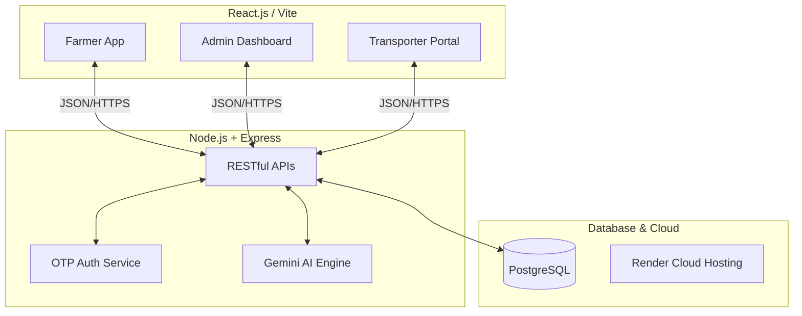
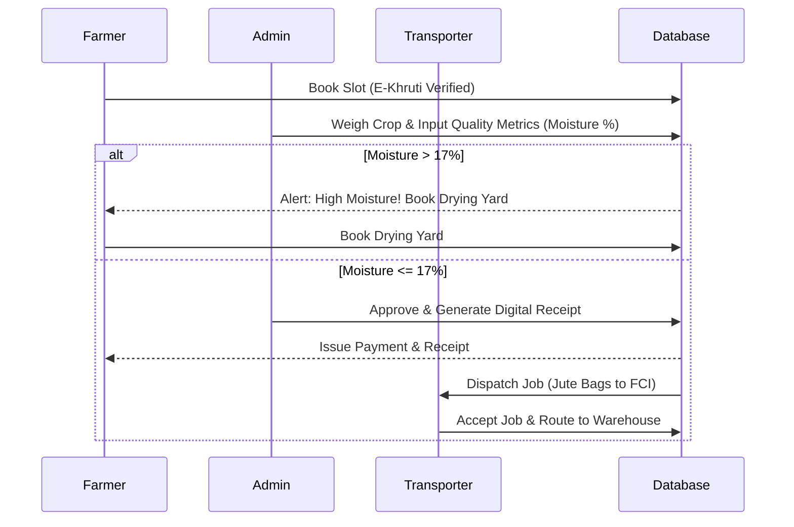

# Project Report: KrishiSetu
**Smart India Hackathon (SIH) 2026**

---

## 1. Executive Summary
**KrishiSetu** is an end-to-end digital agricultural procurement and logistics platform designed to modernize the crop procurement process in India. By bridging the gap between Farmers, Procurement Officials, and Transporters, the platform ensures transparency, minimizes post-harvest losses, and streamlines the movement of crops from local centers to Food Corporation of India (FCI) warehouses.

## 2. Project Overview
KrishiSetu is a unified, cloud-based web application built to digitize the entire lifecycle of government crop procurement. The platform serves three primary stakeholders:
1. **Farmers:** Can seamlessly book procurement slots, verify their land records (E-Khruti), track the scientific quality (moisture/impurity) of their harvest in real-time, and dynamically book drying yards if their crops fail quality checks.
2. **Procurement Officials (Admins):** Equipped with a dashboard to input exact scientific metrics, generate digital receipts, simulate IoT center conditions, and use AI to predict regional food shortages for smart redistribution.
3. **Transporters:** Provided with a logistics portal to accept dispatch jobs, track standardized jute bags (batches), and receive precise routing instructions to central FCI warehouses.

By connecting these three pillars, KrishiSetu eliminates the chaos, manual paperwork, and lack of transparency traditionally found in local mandis.

## 3. Problem Statement
The current agricultural procurement ecosystem faces several critical challenges:
* **Lack of Transparency:** Farmers often dispute quality assessments (moisture/impurities) at local mandis due to manual, opaque recording systems.
* **Post-Harvest Spoilage:** High moisture content in crops leads to rejection or spoilage, with farmers lacking immediate access to nearby drying facilities.
* **Logistical Inefficiencies:** The transit of standardized crop bags from procurement centers to FCI central warehouses lacks real-time batch traceability.
* **Identity Fraud:** Weak verification allows unauthorized sellers to bypass the system.

## 4. Proposed Solution
KrishiSetu acts as a unified digital bridge featuring three interconnected dashboards (Farmer, Admin, and Transporter) powered by a robust PostgreSQL backend and AI analytics. 

It introduces **Scientific Quality Assaying**, **Automated Logistics Tracking**, and **E-Khruti Land Verification** to create a tamper-proof, efficient, and highly scalable procurement pipeline.

---

## 5. Technical Architecture

### Tech Stack
* **Frontend:** React.js (Vite), Lucide Icons, Custom Responsive CSS
* **Backend:** Node.js, Express.js
* **Database:** PostgreSQL (Hosted on Render)
* **Authentication:** Cryptographically secure OTP (SMS via Fast2SMS/Twilio, Email via SMTP/API)
* **AI & Analytics:** Google Gemini API
* **Deployment:** Render (CI/CD Integrated with GitHub)

---

## 5. Key Features & Modules

### A. The Farmer Portal
* **E-Khruti Land Verification:** Farmers are badged with a "Land Record Verified" status, ensuring only legitimate producers can book procurement slots.
* **Scientific Quality Report Card:** Farmers see live, dynamic updates of their crop's Moisture (%) and Impurity (%) levels the moment the Admin inputs them.
* **Smart Drying Yard Booking:** If crop moisture exceeds the strict 17% limit, the system instantly flashes a warning and offers an interactive modal to book local Drying Yards with weather and estimated drying times.
* **Dynamic Digital Receipts:** Automatically calculates standardized bagging yields (e.g., 50kg bags) upon successful procurement.

### B. The Admin (Procurement Official) Portal
* **Scientific Quality Assessment:** Officials input exact scientific metrics (Moisture, Impurity, Crop Grade). The system features built-in limits (e.g., flagging >17% moisture).
* **IoT Sensor Integration (Simulated):** Live monitoring of procurement center conditions (Temperature, Humidity, Pest Risk).
* **AI Redistribution Engine:** Uses Gemini AI to analyze center capacities and predict food grain shortages, recommending smart redistribution plans across districts.

### C. The Transporter Portal
* **Traceable Load Details:** Transporters receive exact batch tracking instructions (e.g., *"40 Standard Jute Bags - BATCH #KS-FCI"*).
* **FCI Warehouse Routing:** Explicit pickup and drop-off routing, specifically directing verified batches from local procurement centers to centralized FCI warehouses.

### D. Public Ecosystem
* **Live Government Notices:** A highly professional landing page featuring scrolling official guidelines (e.g., MSP Announcements) complete with secure PDF download integrations.

---

## 6. Procurement Workflow

---

## 7. Impact & Future Scope
### Business Impact
* **Fair Compensation:** Eliminates human bias in quality assessment by providing farmers with undeniable digital proof of their crop grade.
* **Waste Reduction:** AI predictions and IoT integrations prevent spoilage in local warehouses.
* **Optimized Logistics:** Standardized batch tracking ensures zero leakage during transit to FCI.

### Future Enhancements
* **Blockchain Integration:** Immutably storing quality metrics and financial payouts on a distributed ledger.
* **Regional Language Voice Bots:** Allowing farmers to book slots using voice commands in their native dialects via phone calls.
* **Drone Analytics:** Integrating satellite and drone imaging for preemptive yield estimation before the farmer even arrives at the mandi.
